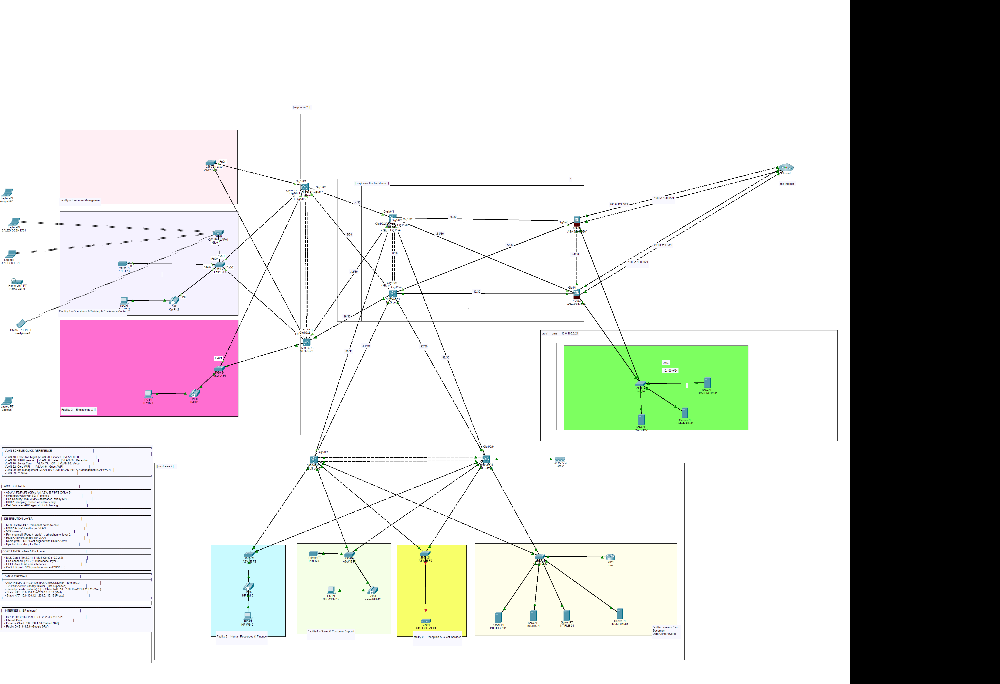

<div align="center">

#  YounesLab Enterprise Network
### Dual-Site Campus Network — OSPF · ASA Firewall · DMZ · VoIP · RADIUS Wireless

[](https://www.netacad.com/)
[]()
[]()
[]()
[]()
[](LICENSE)



> **"This is not a class lab. This is a production-grade enterprise simulation."**

</div>

---

##  Table of Contents

- [Project Overview](#-project-overview)
- [Quick Stats](#-quick-stats)
- [Topology Architecture](#-topology-architecture)
- [VLAN & IP Addressing](#-vlan--ip-addressing)
- [OSPF Multi-Area Design](#-ospf-multi-area-design)
- [High Availability & Redundancy](#-high-availability--redundancy)
- [Security Architecture](#-security-architecture)
- [VoIP — CallManager Express](#-voip--callmanager-express)
- [Wireless — WLC + RADIUS](#-wireless--wlc--radius)
- [Network Services](#-network-services)
- [Quality of Service](#-quality-of-service)
- [Challenges & Solutions](#-challenges--solutions)
- [Validation & Proof Screenshots](#-validation--proof-screenshots)
- [Repository Structure](#-repository-structure)
- [Getting Started](#-getting-started)
- [Skills Demonstrated](#-skills-demonstrated)
- [Author](#-author)

---

##  Project Overview

**YounesLab** is a full-scale enterprise campus network designed and implemented in **Cisco Packet Tracer**. It simulates a real dual-site corporate infrastructure with two geographically separated offices connected through a hierarchical three-tier architecture.

The project covers the complete enterprise network stack:
- **Routing:** Multi-area OSPF with ECMP and inter-area summarization
- **Security:** Cisco ASA firewall with DMZ, bidirectional ACLs, static NAT, dynamic PAT
- **Redundancy:** Dual ISP, HSRP per-VLAN, EtherChannel, STP/HSRP alignment
- **Wireless:** WLC + CAPWAP + RADIUS/802.1X enterprise authentication
- **Voice:** Cisco CallManager Express with 109 extensions across 7 facilities
- **Services:** Split-horizon DNS, DHCP relay, NTP, Syslog, FTP, SNMP
- **Layer 2 Security:** DHCP Snooping, DAI, Port Security, PortFast/BPDU Guard

This is the kind of Packet Tracer project that treats simulation like production.

---

##  Quick Stats

| Metric | Value |
|--------|-------|
| **Offices** | 2 (Office A + Office B) |
| **Facilities** | 7 (F5, F4, F3, F2, F1, FG, FDC) |
| **VLANs** | 14 across both sites |
| **Devices** | 30+ routers, switches, servers, phones |
| **Routing Protocol** | OSPF Multi-Area (Area 0 / 1 / 2 / 100) |
| **Firewall** | Cisco ASA 5506-X (Active + Standby design) |
| **Wireless** | WLC 3504 + CAPWAP + RADIUS/802.1X |
| **VoIP** | CME with **109 extensions** across 7 facilities |
| **OSPF Router IDs** | 8 devices with manually configured RIDs |
| **RADIUS Users** | 6 enterprise accounts |
| **NAT Entries** | 3 static (DMZ) + 1 dynamic PAT pool |

---

##  Topology Architecture

### Three-Tier Hierarchical Design

```
┌─────────────────────────────────────────────────────────────────┐
│                    INTERNET / ISP ZONE                          │
│         ISP-1 (203.0.113.0/29)    ISP-2 (198.51.100.0/29)     │
└───────────────────────┬─────────────────┬───────────────────────┘
                        │                 │
              ┌─────────▼─────────────────▼──────────┐
              │         OSPF AREA 0 — BACKBONE        │
              │  ASA-PRIMARY ↔ MLS-Core1 ↔ MLS-Core2  │
              │         (Port-channel1 EtherChannel)  │
              └───────┬──────────────┬────────────────┘
                      │              │
         ┌────────────▼───┐    ┌────▼────────────────┐
         │  OSPF AREA 2   │    │    OSPF AREA 1 (DMZ) │
         │  Campus LAN    │    │    10.0.100.0/24      │
         │  Office A + B  │    │  Web · Mail · Proxy  │
         └────────────────┘    └──────────────────────┘
```

### Device Roles

####  Core Layer (Area 0 Backbone)
| Device | Model | Role | Router-ID |
|--------|-------|------|-----------|
| MLS-Core1 | 3650-24PS | Primary Core Switch | 10.2.2.1 |
| MLS-Core2 | 3650-24PS | Secondary Core Switch | 10.2.2.2 |
| ASA-PRIMARY | ASA 5506-X | Active Firewall + ABR | 10.3.3.2 |
| ASA-SECONDARY | ASA 5506-X | Standby Firewall | 10.3.3.1 |

####  Distribution Layer (ABR — Area 0 ↔ Area 2)
| Device | Role | HSRP Role | OSPF RID |
|--------|------|-----------|----------|
| MLS-Dsw1 | Office A Distribution | Active VLANs 10,20,30 | 10.1.1.1 |
| MLS-Dsw2 | Office A Distribution | Active VLANs 77,80,92 | 10.1.1.2 |
| MLS-Dsw3 | Office B Distribution | Active VLANs 40,50,60 | 10.1.2.1 |
| MLS-Dsw4 | Office B Distribution | Active VLANs 70,94,99 | 10.1.2.2 |

####  Access Layer
| Device | Location | VLANs |
|--------|----------|-------|
| ASW-A-F5 | Office A — Floor 5 (Executive) | 10, 80, 92, 94, 99 |
| ASW-A-F4 | Office A — Floor 4 (Ops/Training) | 20, 77, 80, 92, 94, 99 |
| ASW-A-F3 | Office A — Floor 3 (Engineering/IT) | 30, 77, 80, 92, 94, 99 |
| ASW-B-F2 | Office B — Floor 2 (HR/Finance) | 40, 80, 92, 94, 99 |
| ASW-B-F1 | Office B — Floor 1 (Sales/Support) | 50, 80, 92, 94, 99 |
| ASW-B-F0 | Office B — Ground Floor (Reception) | 60, 80, 92, 94, 99 |
| ASW-B-srv | Office B — Basement DC | 70, 99 |

####  DMZ Zone (Area 1)
| Device | IP | Role | Public IP |
|--------|----|------|-----------|
| Web-DMZ | 10.0.100.10 | HTTP/HTTPS Web Server | 203.0.113.11 |
| Mail-DMZ | 10.0.100.11 | POP3 Email Server | 203.0.113.12 |
| Proxy-DMZ | 10.0.100.12 | DNS Forwarder | 203.0.113.13 |

####  Internal Servers (VLAN 70 — 10.0.70.0/24)
| Device | IP | Role |
|--------|----|------|
| INT-DHCP-01 | 10.0.70.10 | DHCP Server |
| INT-DC-01 | 10.0.70.11 | Domain Controller · DNS · RADIUS |
| INT-FILE-01 | 10.0.70.12 | File Server · FTP Backup |
| INT-MGMT-01 | 10.0.70.13 | NTP · Syslog · SNMP |
| Voice-CME-2811 | 10.0.70.80 | CallManager Express |

####  Wireless
| Device | Model | IP | Role |
|--------|-------|----|------|
| mWLC | WLC-3504 | 10.1.101.10 | Wireless LAN Controller |
| OffA-F04-LAP01 | AP-3702i | DHCP (VLAN 99) | LWAP Office A |
| OffB-F00-LAP01 | AP-3702i | DHCP (VLAN 101) | LWAP Office B |

---

##  VLAN & IP Addressing

### Office A — 10.0.0.0/8

| VLAN | Name | Subnet | Gateway | Purpose |
|------|------|--------|---------|---------|
| 10 | EXECUTIVE_f5 | 10.0.10.0/24 | 10.0.10.1 | Executive Management — Floor 5 |
| 20 | OPER&CONF_f4 | 10.0.20.0/24 | 10.0.20.1 | Operations & Conference — Floor 4 |
| 30 | IT_f3 | 10.0.30.0/24 | 10.0.30.1 | Engineering & IT — Floor 3 |
| 77 | IOT | 10.0.77.0/24 | 10.0.77.1 | IoT Devices |
| 80 | VOICE | 10.0.80.0/24 | 10.0.80.1 | IP Phones (SCCP) |
| 92 | CORP_WIFI | 10.0.92.0/24 | 10.0.92.1 | Corporate Wireless (RADIUS/802.1X) |
| 94 | GUEST | 10.0.94.0/24 | 10.0.94.1 | Guest Wireless (Internet only) |
| 99 | NET_MGMT | 10.0.99.0/24 | 10.0.99.1 | Management (SSH, NTP, Syslog) |

### Office B — 10.1.0.0/16

| VLAN | Name | Subnet | Gateway | Purpose |
|------|------|--------|---------|---------|
| 40 | HR&FINANCE_f2 | 10.0.40.0/24 | 10.0.40.1 | HR & Finance — Floor 2 |
| 50 | Sales_f1 | 10.0.50.0/24 | 10.0.50.1 | Sales & Support — Floor 1 |
| 60 | RECEPTION_f0 | 10.0.60.0/24 | 10.0.60.1 | Reception & Guest — Ground Floor |
| 70 | SRVS_f-1 | 10.0.70.0/24 | 10.0.70.1 | Server Farm — Basement DC |
| 77 | IOT | 10.1.77.0/24 | 10.1.77.1 | IoT Devices |
| 80 | VOICE | 10.1.80.0/24 | 10.1.80.1 | IP Phones (SCCP) |
| 92 | CORP_WIFI | 10.1.92.0/24 | 10.1.92.1 | Corporate Wireless |
| 94 | GUEST | 10.1.94.0/24 | 10.1.94.1 | Guest Wireless |
| 99 | NET_MGMT | 10.1.99.0/24 | 10.1.99.1 | Management |
| 101 | APs_MGMT | 10.1.101.0/24 | 10.1.101.1 | AP Management (CAPWAP) |

### DMZ & Public Addressing

| Network | Subnet | Purpose |
|---------|--------|---------|
| DMZ | 10.0.100.0/24 | DMZ server zone |
| ISP-1 → ASA | 203.0.113.0/29 | Primary WAN |
| ISP-2 → ASA | 198.51.100.0/29 | Secondary WAN |
| Internet Core → ISP-1 | 192.0.2.0/30 | Backbone simulation |
| Internet Core → ISP-2 | 192.0.2.4/30 | Backbone simulation |

### Internal Point-to-Point Links (/30)

| Link | Subnet | Devices |
|------|--------|---------|
| Core Interconnect | 10.255.255.0/30 | MLS-Core1 ↔ MLS-Core2 (Port-channel1) |
| Core → Dsw links | 10.255.255.4/30 – 16/30, 80/30 – 92/30 | MLS-Core ↔ MLS-Dsw1-4 |
| ASA → Core | 10.255.255.40/30, 44/30 | ASA ↔ MLS-Core1/2 |

---

##  OSPF Multi-Area Design

### Area Map

| Area | Type | Subnets | Devices | Purpose |
|------|------|---------|---------|---------|
| **Area 0** | Backbone | 10.255.255.0/24 | Core switches, ASA, ISP routers | Transit backbone |
| **Area 1** | Normal | 10.0.100.0/24 | ASA (ABR), DMZ servers | DMZ isolation |
| **Area 2** | Stub | 10.0.0.0/16, 10.1.0.0/16 | Distribution switches, VLANs | Campus user access |
| **Area 100** | External | 192.0.2.0/30, 8.8.8.0/24 | ISP routers, Internet core | External routing simulation |

### OSPF Router IDs

| Device | Router-ID | Role |
|--------|-----------|------|
| MLS-Dsw1 | 10.1.1.1 | ABR Area 0/2 |
| MLS-Dsw2 | 10.1.1.2 | ABR Area 0/2 |
| MLS-Dsw3 | 10.1.2.1 | ABR Area 0/2 |
| MLS-Dsw4 | 10.1.2.2 | ABR Area 0/2 |
| MLS-Core1 | 10.2.2.1 | Internal Area 0 |
| MLS-Core2 | 10.2.2.2 | Internal Area 0 |
| ASA-PRIMARY | 10.3.3.2 | ABR Area 0/1 + ASBR |
| ASA-STANDBY | 10.3.3.1 | ABR Area 0/1 |

### Key OSPF Features
- **ECMP:** Maximum 4 equal-cost paths
- **Default Route:** `O*E2` injected by ASA-PRIMARY via `default-information originate`
- **ASA as ABR:** Area 0 backbone ↔ Area 1 DMZ boundary
- **Inter-area routes:** All VLAN subnets appear as `O IA` on core switches
- **Tuned timers:** Hello 1s / Dead 4s on WAN interfaces for fast convergence

### Configuration Example (MLS-Core1)

```bash
router ospf 1
 router-id 10.2.2.1
 network 10.255.255.0 0.0.0.255 area 0
 network 10.0.0.0 0.255.255.255 area 0
 maximum-paths 4
```

### Verification Commands

```bash
show ip ospf neighbor
show ip route ospf
show ip ospf border-routers
show ip ospf database summary
```

---

##  High Availability & Redundancy

### Dual ISP Redundancy
  ### Internet Core Router — Default Routes

  The Internet Core Router (Router3) simulates the ISP backbone. It has two default routes for redundancy:
  
  
  ip route 0.0.0.0 0.0.0.0 GigabitEthernet0/0/0      ! Primary (AD 1)
  ip route 0.0.0.0 0.0.0.0 GigabitEthernet0/1/0 2    ! Backup (AD 2)

### HSRP Per-VLAN (HSRPv2)

HSRP configured on all distribution switches. Active/standby aligned with STP root.

| VLAN | VIP | Active | Standby | Priority |
|------|-----|--------|---------|----------|
| 10 | 10.0.10.1 | MLS-Dsw1 | MLS-Dsw2 | 110 / 90 |
| 20 | 10.0.20.1 | MLS-Dsw1 | MLS-Dsw2 | 110 / 90 |
| 30 | 10.0.30.1 | MLS-Dsw1 | MLS-Dsw2 | 110 / 90 |
| 77 | 10.0.77.1 | MLS-Dsw2 | MLS-Dsw1 | 110 / 90 |
| 80 | 10.0.80.1 | MLS-Dsw2 | MLS-Dsw1 | 110 / 90 |
| 92 | 10.0.92.1 | MLS-Dsw2 | MLS-Dsw1 | 110 / 90 |

### STP / HSRP Alignment

> **Critical Design Decision:** STP root bridge = HSRP active switch per VLAN.
> Misalignment causes traffic to hairpin through the standby switch — wasting bandwidth and adding latency.

```bash
! On MLS-Dsw1 (HSRP Active for VLANs 10,20,30)
spanning-tree vlan 10,20,30 root primary
spanning-tree mode rapid-pvst

! On MLS-Dsw2 (HSRP Active for VLANs 77,80,92)
spanning-tree vlan 77,80,92 root primary
```

### EtherChannel

| Link | Protocol | Ports | Type | IP |
|------|----------|-------|------|----|
| MLS-Core1 ↔ MLS-Core2 | PAgP (desirable) | Gi1/0/5-6 | Layer 3 | 10.255.255.0/30 |
| MLS-Dsw1 ↔ MLS-Dsw2 | LACP (active) | Gi1/0/x | Layer 2 | — |

### Dual ISP Redundancy

```
Primary Path:   Internal → ASA → ISP-1 (203.0.113.0/29)
Backup Path:    Internal → ASA → ISP-2 (198.51.100.0/29)

Failover Mechanism:
  - IP SLA tracking on ASA monitors ISP-1 health
  - ASA shifts default route metric on primary link failure
  - OSPF re-advertises new O*E2 default to campus
  - Convergence: ~40s PT / <5s production (tuned timers)
```

### ASA Active/Standby HA

>  **Note:** Full ASA failover (`failover` command) is not supported in Packet Tracer.
> Both ASAs are configured identically. Manual failover validated by configuration synchronization.

| Parameter | ASA-PRIMARY | ASA-STANDBY |
|-----------|-------------|-------------|
| Outside IP | 203.0.113.10 | 203.0.113.2 |
| Inside IP | 10.255.255.42 | 10.255.255.38 |
| DMZ IP | 10.0.100.1 | 10.0.100.2 |
| Failover Link | Gi1/3 | Gi1/3 |

---

##  Security Architecture

### ASA Security Zones

| Zone | Interface | Security Level | IP |
|------|-----------|----------------|-----|
| Outside | Gi1/7 + Gi1/8 | 0 | 203.0.113.10 / 198.51.100.10 |
| DMZ | Gi1/6 | 50 | 10.0.100.1 |
| Inside | Gi1/2 | 100 | 10.255.255.42 / 10.255.255.70 |

### Static NAT (DMZ → Public)

| Private IP | Public IP | Service |
|------------|-----------|---------|
| 10.0.100.10 | 203.0.113.11 | Web Server (HTTP/HTTPS) |
| 10.0.100.11 | 203.0.113.12 | Mail Server (POP3) |
| 10.0.100.12 | 203.0.113.13 | Proxy Server (DNS) |

### Dynamic PAT (Inside → Internet)

```
Inside network 10.0.0.0/8 → PAT to outside interface IP
All internal clients share one public IP for outbound internet access
```

### ACL Policies

**OUTSIDE_IN — Internet → DMZ (explicit permit only)**
```
permit tcp any host 10.0.100.10 eq www
permit tcp any host 10.0.100.10 eq 443
permit tcp any host 10.0.100.11 eq smtp
permit tcp any host 10.0.100.11 eq pop3
permit icmp any host 10.0.100.10
deny   ip any any (implicit)
```

**DMZ_POLICY — DMZ → Inside (blocked by default)**
```
deny tcp 10.0.100.0/24 → 10.0.0.0/8
deny udp 10.0.100.0/24 → 10.0.0.0/8
permit ip any any
```

> **Why this matters:** DMZ servers cannot initiate connections to internal subnets.
> A compromised DMZ server cannot be used as a pivot to attack the internal network.
> This is defense-in-depth — the firewall enforces it regardless of server-side config.

### Layer 2 Security Stack

```
DHCP Snooping  →  builds MAC→IP→VLAN→port binding table
      ↓
Dynamic ARP Inspection  →  validates every ARP against binding table
      ↓
ARP poisoning attacks stopped at hardware level
```

| Feature | Config | Protects Against |
|---------|--------|-----------------|
| DHCP Snooping | Trusted: uplinks only / Rate limit: 15pps untrusted | DHCP starvation, rogue DHCP |
| DAI | All active VLANs / Validate src-mac dst-mac ip | ARP poisoning, ARP spoofing |
| Port Security | Max 3 MACs / Sticky / Violation: Restrict | MAC flooding, unauthorized devices |
| PortFast + BPDU Guard | All access ports facing end hosts | Accidental loops, rogue switches |
| Root Guard | Uplinks on distribution switches | STP topology attacks |

### Management Security

```bash
! SSH v2 only — Telnet disabled
ip ssh version 2
crypto key generate rsa modulus 2048

! VTY restricted to Management VLAN 99
ip access-list standard MGMT-ONLY
 permit 10.0.99.0 0.0.0.255
line vty 0 4
 access-class MGMT-ONLY in
 transport input ssh
 login local
```

---

##  VoIP — CallManager Express

### CME Configuration

| Parameter | Value |
|-----------|-------|
| Device | Voice-CME-2811 (10.0.70.80) |
| Max ephones | 42 |
| Max directory numbers | 60 |
| Source address | 10.0.70.80:2000 |
| Codec | G.711 |
| Auto-assign | 1 to 10 |

### Extension Map — 109 Total Extensions

| Facility | Department | Extensions | Count |
|----------|------------|------------|-------|
| FG (Ground) | Reception & Guest Services | 5000–5008 | 9 |
| F1 | Sales & Customer Support | 5100–5119 | 20 |
| F2 | Human Resources & Finance | 5200–5219 | 20 |
| F3 | Engineering & IT | 5300–5319 | 20 |
| F4 | Operations, Training, Conference | 5400–5419 | 20 |
| F5 | Executive Management | 5500–5509 | 10 |
| FDC | Data Center Core | 5600–5609 | 10 |

### Zero-Touch Phone Deployment

```bash
! DHCP Option 150 points phones to TFTP/CME server
ip dhcp pool VOICE-A
 network 10.0.80.0 255.255.255.0
 default-router 10.0.80.1
 option 150 ip 10.0.70.80

! Phone boot sequence:
! 1. DHCP lease → gets IP + Option 150 (TFTP server IP)
! 2. TFTP request → downloads SEP<MAC>.cnf.xml
! 3. SCCP registration → extension assigned automatically
! 4. No manual phone configuration required
```

### Cross-Site Dial Peers

```bash
! Office A → Office B (5xxx extensions)
dial-peer voice 100 voip
 destination-pattern 5...
 session target ipv4:10.0.80.1
 codec g711ulaw

! Office B → Office A (6xxx extensions)
dial-peer voice 200 voip
 destination-pattern 6...
 session target ipv4:10.0.70.80
 codec g711ulaw
```

### Verification Commands

```bash
show ephone registered
show ephone-dn summary
show dial-peer voice summary
show telephony-service
```

---

##  Wireless — WLC + RADIUS

### WLC Settings

| Parameter | Value |
|-----------|-------|
| Management IP | 10.1.101.10 |
| Management VLAN | 101 |
| RADIUS Server | INT-DC-01 (10.0.70.11) |
| Auth Port | 1812 |
| Shared Secret | CiscoRadius123 |

### SSID Configuration

| SSID | VLAN | Security | Auth | Access |
|------|------|----------|------|--------|
| CORP-WIFI | 92 | WPA2-Enterprise | RADIUS/802.1X | Full internal |
| GUEST-WIFI | 94 | Open | None | Internet only |

### RADIUS Authentication Flow

```
Wireless Client
      │
      │ 1. Associate to CORP-WIFI AP
      ▼
Lightweight AP (CAPWAP tunnel)
      │
      │ 2. Tunnel to WLC
      ▼
WLC (10.1.101.10)
      │
      │ 3. RADIUS Access-Request → INT-DC-01:1812
      ▼
INT-DC-01 RADIUS Server (10.0.70.11)
      │
      │ 4. Validate credentials against user database
      ▼
      Access-Accept / Access-Reject
      │
      │ 5. Accept → client gets IP from VLAN 92 pool
      │    Reject → no network access
```

### RADIUS User Database

| Username | Domain | Role |
|----------|--------|------|
| net.admin | youneslab.local | Network Administrator |
| exec.younes | youneslab.local | Executive |
| hr.payroll | youneslab.local | HR / Payroll |
| ops.center | youneslab.local | Operations |
| reception.lobby | — | Front Desk |
| sales.rep | — | Sales |

### CAPWAP AP Discovery

```bash
! Cross-subnet AP discovery via DHCP Option 43
ip dhcp pool MGMT_APs
 network 10.1.99.0 255.255.255.0
 default-router 10.1.99.1
 option 43 hex f104.0a01.630a    ! WLC IP: 10.1.99.10

! Verification on access switch
show interfaces trunk
show mac address-table interface [AP port]
```

### Verification Commands

```bash
show wlan summary
show ap summary
show capwap summary
show radius summary
show client summary
```

---

##  Network Services

### DNS — Split-Horizon Architecture

```
INTERNAL DNS (INT-DC-01 @ 10.0.70.11) — youneslab.local zone:
  backup.youneslab.local  →  10.0.100.12
  dc.youneslab.local      →  10.0.70.12
  dhcp.youneslab.local    →  10.0.70.11
  file.youneslab.local    →  10.0.70.10
  mail.youneslab.local    →  10.0.70.12
  mgmt.youneslab.local    →  10.0.100.11
  proxy.youneslab.local   →  10.0.70.13
  youneslab.local         →  10.0.100.12

DMZ PROXY FORWARDER (Proxy-DMZ @ 10.0.100.12) — external:
  google.com   →  8.8.8.8
  cisco.com    →  72.163.4.161

SECURITY BENEFIT:
  Internal clients query INT-DC-01 only
  External queries forwarded to proxy
  Internal clients NEVER contact 8.8.8.8 directly
  Internal DNS zone never exposed to internet
```

### DHCP

- **Data VLANs:** Served by INT-DHCP-01 (10.0.70.10) via `ip helper-address`
- **Voice VLANs:** Served by CME router DHCP pools (with Option 150)
- **Relay:** Configured on all distribution switch SVIs

### NTP

```bash
! INT-MGMT-01 as NTP master
ntp master 5

! All devices authenticate and sync
ntp server 10.0.70.13 key 1
ntp authenticate
ntp authentication-key 1 md5 <key>
ntp trusted-key 1
```

### Syslog

- **Server:** INT-MGMT-01 (10.0.70.13)
- **Events captured:**
  - Interface state changes
  - OSPF adjacency formation/loss
  - HSRP state transitions
  - Port security violations
  - SSH authentication failures
  - DHCP binding events

### FTP — Configuration Backup

```bash
ip ftp username cisco
ip ftp password cisco
copy running-config ftp:
! Destination: INT-FILE-01 (10.0.70.12)
```

### SNMP v2c

```bash
snmp-server community ItDepRead ro
snmp-server community ItDepWrite rw
snmp-server location Server-Room-DC-Basement
snmp-server contact netops@youneslab.local
snmp-server enable traps
snmp-server host 10.0.70.13 ItDepRead
```

---

##  Quality of Service

### End-to-End QoS Architecture

```
Access Switch (ASW-A-F3)
  └─ trust cos + trust device cisco-phone
  └─ Phone marks DSCP EF at ingress

Distribution Switch (MLS-Dsw1-4)
  └─ trust dscp on uplinks (pass through)

Core Switch (MLS-Core1)
  └─ trust dscp on all uplinks
  └─ LLQ policy on WAN Port-channel1

WAN Link (Port-channel1 to Office B)
  └─ class VOICE_TRAFFIC → priority percent 30
  └─ class class-default → fair-queue
```

### LLQ Policy Configuration

```bash
class-map match-all VOICE_TRAFFIC
 match ip dscp ef

policy-map WAN_LAG_QOS
 class VOICE_TRAFFIC
  priority percent 30        ! 30% strict priority for voice
 class class-default
  fair-queue                 ! fair queueing for data

interface port-channel1
 service-policy output WAN_LAG_QOS
```

### Verification Commands

```bash
show policy-map
show mls qos interface fastethernet 0/3
show mls qos interface gigabitethernet 1/0/1
```

---

##  Challenges & Solutions

Real problems encountered and solved during implementation. These are documented to show troubleshooting methodology, not just configuration knowledge.

<details>
<summary><b>1. Layer 2 VLAN Instantiation on Multilayer Switches</b></summary>

**Problem:** MLS dropped frames — VLAN not in database despite trunk carrying the tag.

**Root Cause:** MLS requires explicit VLAN database entry even if no access port uses it.

**Solution:**
```bash
vlan 40,50,60,70
```
**Takeaway:** Trunk carries tags — MLS must have the VLAN instance to process them.
</details>

<details>
<summary><b>2. STP Blocking DHCP Requests</b></summary>

**Problem:** DHCP discovery dropped. STP was in listening/learning state.

**Solution:**
```bash
interface fastethernet 0/3
 spanning-tree portfast
```
**Takeaway:** PortFast moves port immediately to forwarding — critical for DHCP timing.
</details>

<details>
<summary><b>3. Trunk Allowed VLAN Mismatch</b></summary>

**Problem:** Inter-VLAN routing failed between specific VLANs.

**Solution:**
```bash
switchport trunk allowed vlan 10,20,30,40,50,60,70,80,92,94,99
```
**Takeaway:** Every VLAN must be explicitly listed — no implicit allow.
</details>

<details>
<summary><b>4. HSRP and STP Misalignment</b></summary>

**Problem:** Traffic hairpinning through standby switch — suboptimal paths.

**Solution:** Align STP root with HSRP active per VLAN.

**Takeaway:** HSRP active = STP root. Misalignment wastes bandwidth at every packet.
</details>

<details>
<summary><b>5. EtherChannel Compatibility Error (%EC-5-CANNOT_BUNDLE2)</b></summary>

**Problem:** One port suspended — DTP mode mismatch, different VLAN masks.

**Solution:** Configure both ports identically before bundling:
```bash
interface range gigabitethernet1/0/6-7
 switchport mode trunk
 switchport nonegotiate
 channel-group 1 mode active
```
**Takeaway:** EtherChannel requires bit-for-bit identical port configuration.
</details>

<details>
<summary><b>6. VTP Revision Number Bomb</b></summary>

**Problem:** All VLANs disappeared — switch with higher revision but empty database propagated.

**Solution:** Reset VTP domain and restore VLAN database manually.

**Takeaway:** VTP highest revision always wins — even empty database. Use Transparent mode in production.
</details>

<details>
<summary><b>7. DHCP Option 43 for Cross-Subnet AP Discovery</b></summary>

**Problem:** Office B APs couldn't discover WLC — different subnet, no Layer 2 broadcast reach.

**Solution:**
```bash
ip dhcp pool MGMT_APs
 option 43 hex f104.0a01.630a    ! WLC IP encoded
```
**Takeaway:** Cross-subnet CAPWAP requires Option 43. APs boot untagged — native VLAN must match management VLAN for discovery.
</details>

<details>
<summary><b>8. OSPF Route in LSDB but Missing from RIB (Packet Tracer Bug)</b></summary>

**Problem:** `show ip ospf database` showed the route. `show ip route` did not. Next-hop was reachable. Route counter showed `4294967295` (0xFFFFFFFF).

**Root Cause:** Packet Tracer SPF-to-RIB installation bug when ASA advertises Type 3 LSAs into a stub area.

**Solutions tried (in order):**
1. Changed ASA Router-ID to non-interface IP
2. `clear ip ospf process` to force SPF recalculation  
3. Converted Area 1 to totally stubby (`area 1 stub no-summary`)
4. **Final fix:** Redistributed DMZ as connected route — Type 5 external instead of Type 3 inter-area

**Takeaway:** PT's OSPF RIB installation silently fails for Type 3 LSAs from ASA ABR in stub areas. Type 5 redistribution is more reliable in PT.
</details>

<details>
<summary><b>9. HSRP Flickering — WLC Trunk Loop</b></summary>

**Problem:** HSRP flapping every 5 seconds. Standby → Active → Speak loop.

**Root Cause:** WLC connected as trunk. PT's simulated WLC lacks STP — creates Layer 2 bridging loop.

**Solution:**
```bash
! Convert WLC port to access mode
switchport mode access
switchport access vlan 101
clear mac address-table dynamic
```
**Takeaway:** PT's WLC cannot be trunked. Access port + dedicated management VLAN only.
</details>

<details>
<summary><b>10. Phone-Reg-Rej After DHCP Fix</b></summary>

**Problem:** Phone got correct IP but registration rejected.

**Root Cause:** PT cached phone MAC in rejected state from earlier failed attempt.

**Solution:**
```bash
telephony-service
 no create cnf-files
 create cnf-files
! Then power-cycle phone
```
**Takeaway:** PT retains registration state. Regenerate CNF files to clear stale cache.
</details>

<details>
<summary><b>11. QoS Policy on Port-channel — Unsupported Command</b></summary>

**Problem:** `show policy-map interface port-channel1` not supported in PT.

**Solution:** Verify via `show policy-map` + `show mls qos interface` on access ports.

**Takeaway:** Document PT limitations honestly. Configuration exists even if verification commands are missing.
</details>

> **Full list of 19+ challenges documented in [docs/challenges-and-solutions.md](docs/challenges-and-solutions.md)**

---

##  Validation & Proof Screenshots

All screenshots available in the [`/screenshots`](screenshots/) directory.

#  Validation & Proof Screenshots

All screenshots available in the [`/screenshots`](screenshots/) directory.

| # | Feature | Filename |
|---|---------|----------|
| **ASA Security** |||
| 1 | ASA Static NAT (`show xlate` + browser test) | `screenshots/ASA-nat.png` |
| 2 | ASA ACL Policy (OUTSIDE_IN + DMZ_POLICY) | `screenshots/acl-ASA.png` |
| **OSPF Routing** |||
| 3 | OSPF Neighbors (`show ip ospf neighbor`) | `screenshots/ospf-neighbors.png` |
| 4 | OSPF Routes (`show ip route ospf`) | `screenshots/ospf-routes.png` |
| **HSRP + STP Redundancy** |||
| 5 | HSRP Standby Brief (`show standby brief`) | `screenshots/standby-brief.png` |
| 6 | STP Root per VLAN (`show spanning-tree vlan 10`) | `screenshots/spanningTree-vlan.png` |
| 7 | STP Root Summary (`show spanning-tree summary`) | `screenshots/st-summary-root.png` |
| 8 | STP Access Switch (`show spanning-tree` on ASW) | `screenshots/st-summary-acess-sw.png` |
| **DMZ Services** |||
| 9 | DMZ Proxy Forwarder (google.com → 8.8.8.8) | `screenshots/dmz-proxy.png` |
| **Wireless + RADIUS** |||
| 10 | RADIUS User Database (INT-DC-01) | `screenshots/raduis-database.png` |
| 11 | Corporate WiFi Success (VLAN 92) | `screenshots/corp-wifi-success.png` |
| 12 | Guest WiFi Success (VLAN 94, internet only) | `screenshots/Guest-wifi-success.png` |
| 13 | WLC AP Associations (`show ap summary`) | `screenshots/wlc-APs-associations.png` |
| 14 | Corporate WiFi Connecting Screen | `screenshots/copr-connecting.png` |
| 15 | Guest WiFi Connecting Screen | `screenshots/guest-connecting.png` |
| 16 | WLC Client Association (GUI) | `screenshots/client-association-wlc-gui.png` |
| 17 | WLC WLANs (SSID list VLAN 92, 94) | `screenshots/wlans-wlc-gui.png` |
| 18 | WLC RADIUS Configuration (GUI) | `screenshots/raduis-config-on-wlc-gui.png` |
| 19 | WLC Interfaces (VLAN mapped) | `screenshots/interfaces-on-wlc-gui.png` |
| **Split-Horizon DNS** |||
| 20 | Internal DNS Records (INT-DC-01) | `screenshots/dns-records.png` |
| 21 | DMZ Proxy DNS Records (google.com → 8.8.8.8) | `screenshots/dns-records-on-dmz-proxy.png` |
| **Layer 2 Security** |||
| 22 | DHCP Snooping Binding Table | `screenshots/dhcp-snooping-binding.png` |
| 23 | Port Security Interface (f0/3) | `screenshots/port-security-interface.png` |
| 24 | DHCP Pools + Port Security Combined | `screenshots/dhcp-pools+port-sec-interface.png` |
| 25 | DHCP Pools Configuration | `screenshots/dhcp-pools.png` |
| **NTP Services** |||
| 26 | NTP Associations (`show ntp associations`) | `screenshots/ntp-associations.png` |
| 27 | NTP Status (`show ntp status`) | `screenshots/ntp-status.png` |
| 28 | NTP Server Service (INT-MGMT-01) | `screenshots/ntp-service-server.png` |
| 29 | Clock Updated (`show clock` after sync) | `screenshots/clock-updated.png` |
| **SSH Management** |||
| 30 | SSH Configuration (`show ip ssh` + `show ssh`) | `screenshots/ssh-config.png` |
| 31 | SSH Remote Access (mgmt laptop → MLS-Dsw1) | `screenshots/ssh-mgmt-laptop.png` |
| **Syslog** |||
| 32 | Syslog Trigger (interface shutdown/no shutdown) | `screenshots/syslog-trigger.png` |
| 33 | Syslog Server Logs (INT-MGMT-01) | `screenshots/syslog-server-logs.png` |
| **FTP Backup** |||
| 34 | FTP Backup Command (`copy running-config ftp:`) | `screenshots/ftp-backup.png` |
| 35 | FTP Server Database (file confirmed) | `screenshots/fts-server-database.png` |
| **SMTP Email** |||
| 36 | SMTP External → Internal Messaging | `screenshots/smtp-external.png` |
| 37 | SMTP Internal → Internal (Sales ↔ IT) | `screenshots/smtp-internal.png` |
| **SNMP Monitoring** |||
| 38 | SNMP GET — sysUpTime | `screenshots/snmp-get-sysuptime.png` |
| 39 | SNMP GET — sysName (CME hostname) | `screenshots/snmp-get-sysname.png` |
| 40 | SNMP GET — ifDescr (interface description) | `screenshots/snmp-get-ifdescr.png` |
| 41 | SNMP SET — Change Hostname (Step 1) | `screenshots/snmp-set-hostname1.png` |
| 42 | SNMP SET — Change Hostname (Step 2) | `screenshots/snmp-set-hostname.png` |
| 43 | SNMP SET — Verify on CME CLI | `screenshots/snmp-set-verify.png` |
| **VoIP — CME** |||
| 44 | CME Registered Phones (`show ephone registered`) | `screenshots/cme-ephone-registered.png` |
| 45 | CME Phone Summary (`show ephone summary`) | `screenshots/cme-ephone-summary.png` |
| 46 | VoIP Call — Dialing Extension | `screenshots/voip-call-dialing.png` |
| 47 | VoIP Call — Ringing | `screenshots/voip-call-ringing.png` |
| 48 | VoIP Call — Connected | `screenshots/voip-call-connected.png` |
| **QoS — Quality of Service** |||
| 49 | QoS Access Switch Trust (`show mls qos int f0/3`) | `screenshots/qos-access-sw-trust.png` |
| 50 | QoS Core Policy Map (`show policy-map`) | `screenshots/qos-core-policymap.png` |
| 51 | QoS Bug — DSCP 0x00 (Before fix) | `screenshots/qos-bug-dscp-00.png` |
| 52 | QoS Bug — Port Security + Trust Configured | `screenshots/qos-accesss-port-trust-qos.png` |
| 53 | QoS Distribution ACL + Class-Map | `screenshots/qos-distribution-acl.png` |
| 54 | QoS Distribution Remark — DSCP 0x2e Added | `screenshots/qos-dis-remark.png` |
| 55 | QoS Core Verify — Packets Matched (1) | `screenshots/qos-core-verify1.png` |
| 56 | QoS Core Verify — Packets Matched (2) | `screenshots/qos-core-verify2.png` |
| 57 | QoS Core DSCP Preserved (0x2e) | `screenshots/qos-core-dscp-preserved.png` |
| **Printers** |||
| 58 | Printer Ping Test (Cross-site) | `screenshots/printer-pint-test.png` |
| **Internet Core Router** |||
| 59 | Internet Core Default Routes (`show run \| include ip route`) | `screenshots/internet-core-default-routes.png` |
---

youneslab-enterprise-network/
│
├── README.md                          ← You are here
│
├── topology-diagram.png               ← Full network topology (draw.io export)
├── topology-diagram.drawio            ← Editable draw.io source
│
├── packet-tracer/
│   └── youneslab-enterprise.pkt      ← Main Packet Tracer file
│
├── configs/
│   ├── core/
│   │   ├── MLS-Core1.txt
│   │   └── MLS-Core2.txt
│   ├── distribution/
│   │   ├── MLS-Dsw1.txt
│   │   ├── MLS-Dsw2.txt
│   │   ├── MLS-Dsw3.txt
│   │   └── MLS-Dsw4.txt
│   ├── access/
│   │   ├── ASW-A-F5.txt
│   │   ├── ASW-A-F4.txt
│   │   ├── ASW-A-F3.txt
│   │   ├── ASW-B-F2.txt
│   │   ├── ASW-B-F1.txt
│   │   ├── ASW-B-F0.txt
│   │   └── ASW-B-srv.txt
│   ├── firewalls/
│   │   ├── ASA-PRIMARY.txt
│   │   └── ASA-SECONDARY.txt
│   ├── routers/
│   │   ├── ISP-1.txt
│   │   ├── ISP-2.txt
│   │   ├── Voice-CME-2811.txt
│   │   └── Internet-Core-Router3.txt
│   └── wireless/
│       └── WLC-config.txt
│
├── screenshots/
│   ├── ASA-nat.png
│   ├── acl-ASA.png
│   ├── ospf-neighbors.png
│   ├── ospf-routes.png
│   ├── standby-brief.png
│   ├── spanningTree-vlan.png
│   ├── st-summary-root.png
│   ├── st-summary-acess-sw.png
│   ├── dmz-proxy.png
│   ├── raduis-database.png
│   ├── corp-wifi-success.png
│   ├── Guest-wifi-success.png
│   ├── wlc-APs-associations.png
│   ├── copr-connecting.png
│   ├── guest-connecting.png
│   ├── client-association-wlc-gui.png
│   ├── wlans-wlc-gui.png
│   ├── raduis-config-on-wlc-gui.png
│   ├── interfaces-on-wlc-gui.png
│   ├── dns-records.png
│   ├── dns-records-on-dmz-proxy.png
│   ├── dhcp-snooping-binding.png
│   ├── port-security-interface.png
│   ├── dhcp-pools+port-sec-interface.png
│   ├── dhcp-pools.png
│   ├── ntp-associations.png
│   ├── ntp-status.png
│   ├── ntp-service-server.png
│   ├── clock-updated.png
│   ├── ssh-config.png
│   ├── ssh-mgmt-laptop.png
│   ├── syslog-trigger.png
│   ├── syslog-server-logs.png
│   ├── ftp-backup.png
│   ├── fts-server-database.png
│   ├── smtp-external.png
│   ├── smtp-internal.png
│   ├── snmp-get-sysuptime.png
│   ├── snmp-get-sysname.png
│   ├── snmp-get-ifdescr.png
│   ├── snmp-set-hostname1.png
│   ├── snmp-set-hostname.png
│   ├── snmp-set-verify.png
│   ├── cme-ephone-registered.png
│   ├── cme-ephone-summary.png
│   ├── voip-call-dialing.png
│   ├── voip-call-ringing.png
│   ├── voip-call-connected.png
│   ├── qos-access-sw-trust.png
│   ├── qos-core-policymap.png
│   ├── qos-bug-dscp-00.png
│   ├── qos-accesss-port-trust-qos.png
│   ├── qos-distribution-acl.png
│   ├── qos-dis-remark.png
│   ├── qos-core-verify1.png
│   ├── qos-core-verify2.png
│   ├── qos-core-dscp-preserved.png
│   ├── printer-pint-test.png
│   └── internet-core-default-routes.png
│
├── docs/
│   ├── challenges-and-solutions.md
│   ├── vlan-addressing-schema.md
│   ├── ospf-area-design.md
│   └── linkedin-post-series.md
│
└── LICENSE
```

---

##  Getting Started

### Prerequisites

- **Cisco Packet Tracer 8.2+** (recommended for full feature support)
- Download free at: [Cisco NetAcad](https://www.netacad.com/courses/packet-tracer)

### Open the Lab

```bash
# Clone the repository
git clone https://github.com/YOUR-USERNAME/youneslab-enterprise-network.git
cd youneslab-enterprise-network

# Open in Packet Tracer
# File → Open → packet-tracer/youneslab-enterprise.pkt
```

### Quick Validation Tests

After opening, run these to verify the lab is working:

```bash
# 1. Verify OSPF convergence (on MLS-Core1)
show ip ospf neighbor
show ip route ospf

# 2. Test end-to-end routing (from any PC)
ping 10.0.100.10       # Web-DMZ server
ping 8.8.8.8           # Internet (via NAT)

# 3. Verify HSRP gateways
show standby brief     # on MLS-Dsw1

# 4. Check VoIP registration
show ephone registered  # on Voice-CME-2811
```

### Known Packet Tracer Limitations

| Feature | Limitation | Workaround Documented |
|---------|------------|----------------------|
| ASA HA Failover | `failover` command not supported | Manual config sync |
| OSPF RIB from ASA stub | Type-3 LSA RIB install bug | Redistribution used |
| WLC trunk port | PT WLC lacks STP | Access port + VLAN 101 |
| QoS on Port-channel | `show policy-map interface po1` fails | Verify on physical interfaces |
| DHCP Option 150 on generic server | Not supported | CME router DHCP pools used |

---

##  Skills Demonstrated

### Routing & Switching
-  Multi-area OSPF design (Area 0/1/2/100) with ABR/ASBR roles
-  ECMP load balancing (4 paths)
-  HSRP v2 per-VLAN with preemption
-  STP/HSRP alignment per VLAN
-  EtherChannel (PAgP Layer 3 + LACP Layer 2)
-  Rapid PVST+ with PortFast/BPDU Guard/Root Guard
-  Inter-VLAN routing via SVIs
-  DHCP relay (ip helper-address)
-  Three-tier hierarchical campus design

### Security
-  Cisco ASA firewall — three security zones (0/50/100)
-  DMZ segmentation with 3 published services
-  Static NAT for inbound DMZ access
-  Dynamic PAT for outbound internet access
-  Bidirectional ACL policy (inbound permits + DMZ-to-inside block)
-  DHCP Snooping with binding table
-  Dynamic ARP Inspection (DAI)
-  Port Security (sticky MAC, violation restrict)
-  SSH v2 with RSA 2048-bit + VTY ACL
-  Dual ISP failover with SLA tracking

### Wireless & Voice
-  WLC 3504 centralized management
-  CAPWAP tunnel — cross-subnet AP discovery (Option 43)
-  RADIUS/802.1X enterprise wireless authentication
-  WPA2-Enterprise SSID + guest isolation
-  CME VoIP — 109 extensions across 7 facilities
-  DHCP Option 150 for zero-touch phone deployment
-  Cross-site VoIP dial peers
-  End-to-end QoS with LLQ (DSCP EF, 30% voice priority)

### Services & Management
-  Split-horizon DNS (internal DC + DMZ forwarder)
-  Centralized RADIUS authentication (6 enterprise users)
-  NTP with MD5 authentication
-  Centralized Syslog (interface, OSPF, HSRP, security events)
-  FTP configuration backup
-  SNMP v2c monitoring (read + write communities)
-  Structured troubleshooting methodology (19 documented challenges)

---

##  Author

**Younes**
-  LinkedIn: [https://www.linkedin.com/in/younes-oubella-91a178211/]
-  GitHub: [https://github.com/OUBELLA-YOUNES]
-  Email: [yonos.pool@gmail.com]
-  Domain: youneslab.local

---

##  License

This project is licensed under the MIT License — see [LICENSE](LICENSE) for details.

---

<div align="center">

**If this project helped you, consider giving it a ⭐**

*Built with Cisco Packet Tracer · Documented like production · youneslab.local*

</div>
